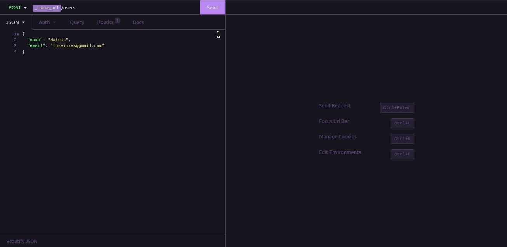

# 🚀 Desafio 04 - Bootcamp Ignite (Rocketseat)
 



## 📙 1. Sobre o desafio
Este desafio consiste na aplicação dos conceitos de SOLID em uma API de gerenciamento de usuários!

## 🏃 2. Como rodar o desafio
Basta dar um git clone neste repositório, carregar as dependências, executar o comando para iniciar o servidor Node e utilizar algum software como Insomnia ou Postman para as requisições
```
git clone https://github.com/Seiixas/desafio04-ignite-nodejs.git
cd desafio04-ignite-nodejs
yarn
yarn dev
```

## ⚙️ 3. Funcionalidades
Todas as funcionalidades podem ser encontradas na rota `localhost:3333/api-docs`, onde encontra-se toda a documentação da API!
